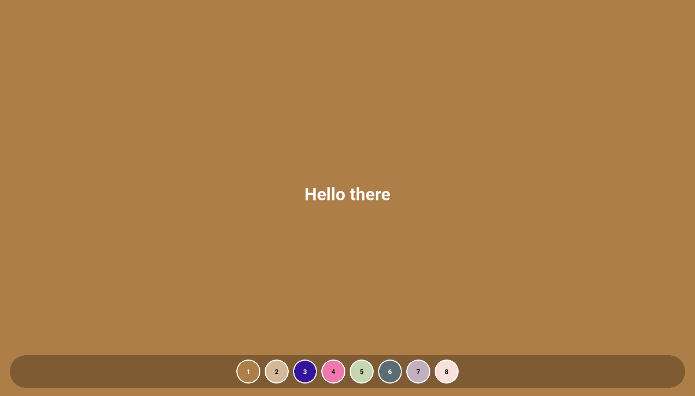

# Random Color Background

A simple Flutter app that changes background color on tap with smooth animations and color history.

## Features

-  **Random color generation** - over 16 million possible colors
-  **Tap to change** - tap anywhere to get a new color
-  **Smooth animations** - animated color transitions
-  **Color history** - tap on previous colors to restore them
-  **Auto contrast** - text color adjusts for readability

## Live Demo

**[Random Color Background Demo Link]()**

## Tech Stack

- **Flutter** with Clean Architecture
- **flutter_bloc** for state management
- **FVM** for Flutter version management
- **solid_lints** for code quality
- **GitHub Pages** for hosting

## Getting Started

```bash
# Clone the repository
git clone https://github.com/your-username/solid_flutter_test_task.git

# Install dependencies
fvm flutter pub get

# Run the app
fvm flutter run
```

## App Preview




